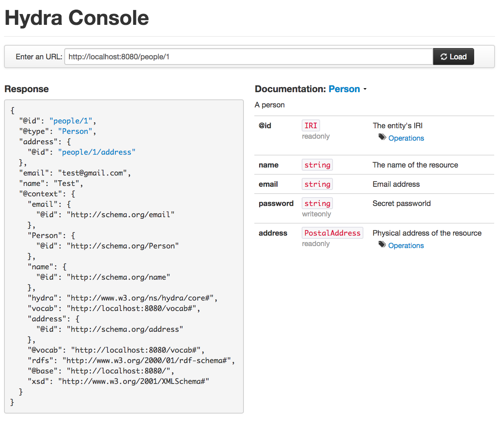
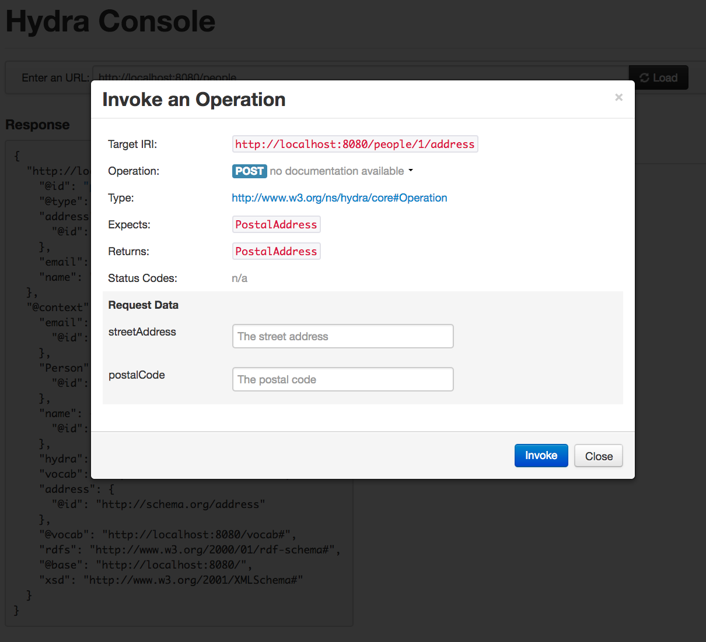
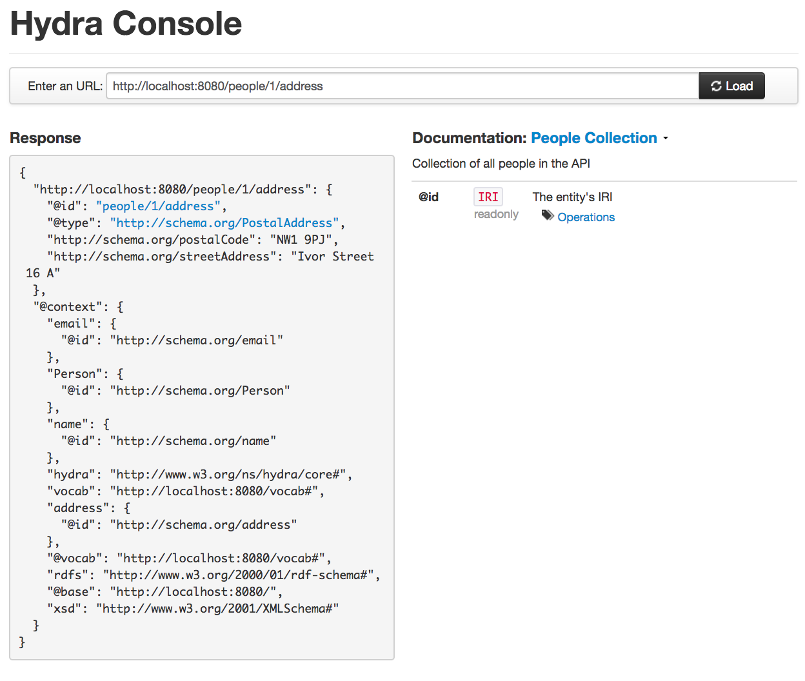
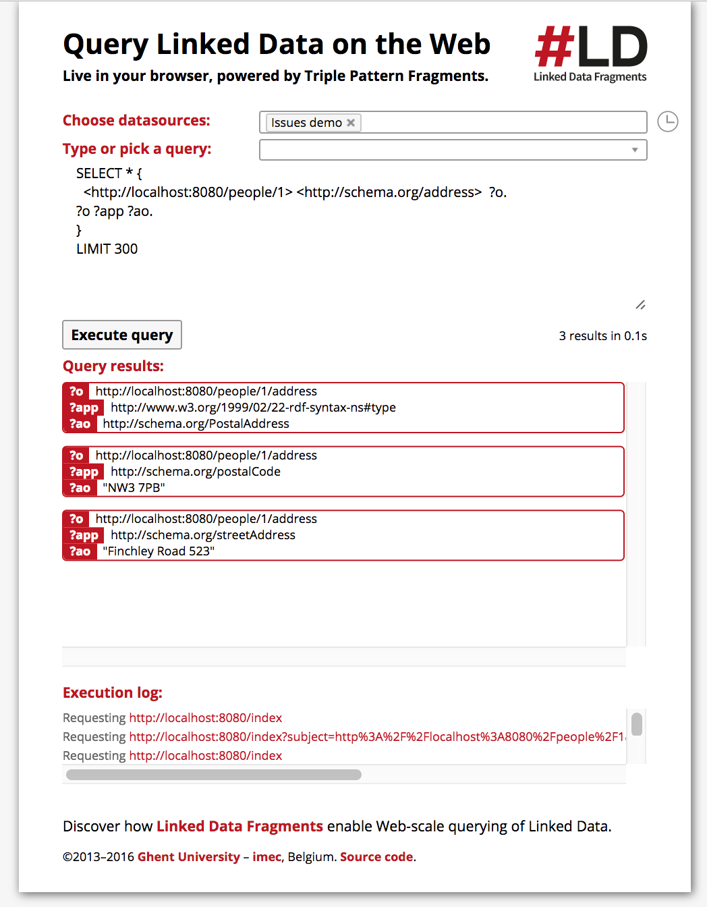

# levanzo [](https://circleci.com/gh/antoniogarrote/levanzo)

Levanzo is Clojure library to build hypermedia driven RESTful APIs using W3C standards.

Levanzo supports the following features:

- Declarative definition of resource classes
- Generation of machine consumable API documentation and meta-data
- Declarative support for validation constraints
- Generation of compatible HTTP middleware for the declared API and link generation functions
- Support for API indices generation that can be used in queries over the API data graph

The library is built on top of the following list of W3C standards and standard proposals:

- [JSON-LD](http://json-ld.org/spec/latest/json-ld/) as the preferred data format
- [Hydra](http://www.hydra-cg.com/spec/latest/core/) as the API vocabulary
- [SHACL](https://www.w3.org/TR/shacl/) as the declarative constraint language
- [Triple Pattern Fragments](https://www.hydra-cg.com/spec/latest/triple-pattern-fragments/) as the interface for API queries
- [SPARQL](https://www.w3.org/TR/sparql11-overview/) as the query language over the API resources

Levanzo uses Clojure Spec, you will need the development version of Clojure 1.9 to use the library.

An example implementation of the Markus Lanthaler's Issues API using MongoDB as the backend [can be found in the examples](examples/issues).
The API console for the demo is deployed [here](http://antoniogarrote.com:8080/).
The Triple Pattern Fragments client for the demo can be found [here](http://antoniogarrote.com:3000/).

## Walkthrough

This section describes the features of Levanzo and the technologies it is based through the development of a small toy API.
The full source code of the example can be found in [`examples/people.clj`](examples/people.clj).

### 1. Setting up your API namespace

One of the main problems with API specification languages like RAML or OpenAPI is that they use flat namespaces and plain strings as identifiers. This makes very difficult to achieve certain use cases like re-using API descriptions or extending the specification.

Levanzo on the other hand uses [Hydra](http://www.hydra-cg.com/spec/latest/core/) as its specification 'vocabulary' that has at its core the RDF data model. This means that identifiers for every single element in the API descriptions are namespaced and uniquely identified by an URI. This also means that you can re-use the terms and meaning of other vocabularies in your API.
For example, you could (and should if the meaning matches your application domain) use terms from the Schema.org vocabulary to build the resources of your API.

The trade-off of using URIs as identifiers instead of strings is that it they are more verbose and working with then can become quite cumbersome.

Levanzo includes some functions in the namespace `levanzo.namespaces` to make it easier to work with URIs in the API specification as well as to work with [compact URIs](https://www.w3.org/TR/curie/) or CURIEs that can reduce the complexity of dealing with URIs as identifiers.

Setting up the name-spaces for the vocabularies you are going to use in your API should be the first task you need to address when working with Levanzo.

The following snippet from the sample application shows how to declare a vocabulary and how to set-up the default vocabulary for our API:

``` clojure
;; let's check the structure of the arguments
(clojure.spec/check-asserts true)

(require '[levanzo.namespaces :as lns]
         '[clojure.test :refer [is]])

;; base URL where the API will be served
(def base (or (System/getenv "BASE_URL") "http://localhost:8080/"))

;; registering the namespace for our vocabulary at /vocab#
(lns/define-rdf-ns vocab (str base "vocab#"))

;; registering schema org vocabulary
(lns/define-rdf-ns sorg "http://schema.org/")
```

Now we can use the *sorg* and *vocab* functions to transform a string into a URI and to expand CURIEs:

``` clojure
;; tests
(is (= "http://localhost:8080/vocab#Test") (vocab "Test"))
(is (= "http://schema.org/Person") (sorg "Person"))
(is (= "http://schema.org/Person") (lns/resolve "sorg:Person"))
```
Certain namespaces are already declared in *levanzo.namespaces*, you don't need to re-declare them:

- rdf
- rdfs
- hydra
- xsd

### 2. Describing your API: declaring resources

Now that we have a namespace, we can start adding definitions to it. The namespace `levanzo.hydra` includes the functions required to declare the components of your API.

The simplest building block in Levanzo is a property.

We can declare properties using the `levanzo.hydra/property` function.

Properties must have an URI identifier and they can have a range, identified by another URI.
Scalar properties have a range over a XSD type like `xsd:float` or `xsd:string`.

The following snippet from the example API declares the [Schema.org streetAddress](https://schema.org/streetAddress) and [postalCode](https://schema.org/postalCode) properties.

``` clojure
(require '[levanzo.hydra :as hydra])
(require '[levanzo.xsd :as xsd])

;; declaring properties
(def street-address-property (hydra/property {::hydra/id (sorg "streetAddress")
                                              ::hydra/title "streetAddress"
                                              ::hydra/description "The street address"
                                              ::hydra/range xsd/string}))

(def postal-code-property (hydra/property {::hydra/id (sorg "postalCode")
                                           ::hydra/title "postalCode"
                                           ::hydra/description "The postal code"
                                           ::hydra/range xsd/string}))
```
In the example, other options for a property like the `title` and `description` are also provided. To see a complete list of arguments, check the documentation for the `hydra/property` function.
The `levanzo.hydra/id` function can be used to extract the URI ID of a component of the Hydra model.

Levanzo is built using [Clojure Spec](https://clojure.org/about/spec), that's the reason you will see so many namespaced keywords in the library.

The next important Hydra concept after properties is the notion of [Hydra classes](http://www.hydra-cg.com/spec/latest/core/#hydra:Class). Classes are collection of resources with shared semantics, meaning by shared semantics that they are described using the same set of properties.
To group the properties of a Hydra class we use the `levanzo.hydra/supported-property` function. `supported-property` allows us to describe some constraints about properties when they are used to describe instances of that Hydra class. Examples of constraints are [`::hydra/required`](http://www.hydra-cg.com/spec/latest/core/#hydra:required), [`::hydra/readonly`]((http://www.hydra-cg.com/spec/latest/core/#hydra:readonly)) and [`::hydra/writeonly`]((http://www.hydra-cg.com/spec/latest/core/#hydra:writeonly)).

This information, plus the range of the property will be used by Levanzo to perform constraint validations on incoming data.

Finally, the Hydra class can be described using the `levanzo.hydra/class` function.
The following snippet declares the [Schema.org PostalAddress](https://schema.org/PostalAddress) class.

``` clojure
;; The PostalAddress class
(def sorg-PostalAddress (hydra/class {::hydra/id (sorg "PostalAddress")
                                      ::hydra/title "PostalAddress"
                                      ::hydra/description "The mailing address"
                                      ::hydra/supported-properties
                                      [(hydra/supported-property
                                        {::hydra/property sorg-street-address
                                         ::hydra/required true})
                                       (hydra/supported-property
                                        {::hydra/property sorg-postal-code})]}))
```

Properties can also have as values links to other resources. Links are declared using the `levanzo.hydra/link` function.

The following lines of code declare the [Schema.org address](https://schema.org/address) property that can be used to link People to PostalAddresses.
Other scalar properties to model a [Schema.org Person](https://schema.org/Person) are also defined.
We also define a scalar property in our vocabulary namespace the `password` property. We mark this property as `required` and `writeonly`. That means that will be required required but only when we write data in the resource, for example in a POST operation.

``` clojure
;; People -> address -> PostalAddress link
(def sorg-address (hydra/link {::hydra/id (sorg "address")
                               ::hydra/title "address"
                               ::hydra/description "Physical address of the resource"
                               ::hydra/range (hydra/id sorg-PostalAddress)}))


;; Properties for People
(def sorg-name (hydra/property {::hydra/id (sorg "name")
                                ::hydra/title "name"
                                ::hydra/description "The name of the resource"
                                ::hydra/range xsd/string}))


(def sorg-email (hydra/property {::hydra/id (sorg "email")
                                 ::hydra/title "email"
                                 ::hydra/description "Email address"
                                 ::hydra/range xsd/string}))

(def vocab-password (hydra/property {::hydra/id (vocab "password")
                                     ::hydra/title "password"
                                     ::hydra/description "Secret passworld"
                                     ::hydra/range xsd/string}))
```
Links are also connected to classes using the `levanzo.hydra/supported-property` function, but when connecting links, we can declare a collection of [Hydra operations](http://www.hydra-cg.com/spec/latest/core/#hydra:operation) specifying how links introduced by this property can be accessed using HTTP requests:

``` clojure

;; The Person class
(def person-address-link (hydra/supported-property {::hydra/id (vocab "address-link")
                                                    ::hydra/property sorg-address
                                                    ::hydra/readonly true
                                                    ::hydra/operation
                                                    [(hydra/get-operation
                                                      {::hydra/returns (hydra/id sorg-PostalAddress)})
                                                     (hydra/post-operation
                                                      {::hydra/expects (hydra/id sorg-PostalAddress)
                                                       ::hydra/returns (hydra/id sorg-PostalAddress)})
                                                     (hydra/delete-operation {})]}))

(def sorg-Person (hydra/class {::hydra/id (sorg "Person")
                               ::hydra/title "Person"
                               ::hydra/description "A person"
                               ::hydra/supported-properties
                               [(hydra/supported-property
                                 {::hydra/property sorg-name})
                                (hydra/supported-property
                                 {::hydra/property sorg-email
                                  ::hydra/required true})
                                (hydra/supported-property
                                 {::hydra/property vocab-password
                                  ::hydra/required true
                                  ::hydra/writeonly true})
                                person-address-link]
                               ::hydra/operations
                               [(hydra/get-operation {::hydra/returns sorg-Person})
                                (hydra/delete-operation {})]}))
```
In the previous example we have defined three operations for the address link. The operations are bound to the HTTP GET, POST and DELETE HTTP methods.
For each operation we have also established the expected and return types. Finally, notice that we have given an optional URI ID to the supported property for the link.
This ID will be useful when declaring the HTTP bindings for this API as well as to generate link URIs programatically.

The `sorg-Person` class also has a list operations associated to them that can be invoked through the URI identifying any instance of the Person class.

For more details about how to declare affordances for the resources of an API using Hydra and Levanzo, please read the [spec documentation](http://www.hydra-cg.com/spec/latest/core/#adding-affordances-to-representations) and the documentation for the Clojure functions.

### 3. Instance creation, validation and generators

Once we have declared our API, we can create JSON-LD instances of the classes we have defined.

The functions to work with JSON-LD are defined in the namespace `levanzo.payload`.

To create a new JSON-LD document we can use the `levanzo.payload/jsonld` function. `jsonld` accepts pairs with a property and the value for the property and generates the JSON-LD document out of them.  We can also use other auxiliary functions in the namespace to declare properties and links.

``` clojure
;; Working with payloads

(require '[levanzo.payload :as payload])

(def address (payload/jsonld
              ["@type" (hydra/id sorg-PostalAddress)]
              [(hydra/id sorg-street-address) {"@value" "Finchley Road 523"}]
              [(hydra/id sorg-postal-code) {"@value" "NW3 7PB"}]))

(def address-alt (payload/instance
                  sorg-PostalAddress
                  (payload/supported-property {:property sorg-street-address
                                               :value "Finchley Road 523"})
                  (payload/supported-property {:property sorg-postal-code
                                               :value "NW3 7PB"})))
(is (= address address-alt))
```

JSON-LD documents can be validated using the information described in the API Hydra classes. Data ranges, required, readonly and writeonly flags will be used to check if the document is valid.

All the validation functionality is in the `levanzo.schema` namespace. The function `levanzo.schema/valid-instance?` can be used to check if one document is valid provided a certain access mode and a collection of classes.

The output of this function is a map, with classes URIs as keys and validation error descriptions as value if the instance is invalid or nil if the document is valid for that class. All the declared classes in the JSON-LD instance will be checked for constraints.

The following snippet shows the validation of different instances of the Person and PostalAddress classes:

``` clojure
(require '[levanzo.schema :as schema])

;; valid
(schema/valid-instance? :read
                        (payload/instance
                         sorg-PostalAddress
                         (payload/supported-property {:property sorg-street-address
                                                      :value "Finchley Road 523"})
                         (payload/supported-property {:property sorg-postal-code
                                                      :value "NW3 7PB"}))
                        {:supported-classes [sorg-PostalAddress]})

;; valid, postal code is optional on read
(schema/valid-instance? :read
                        (payload/instance
                         sorg-PostalAddress
                         (payload/supported-property {:property sorg-street-address
                                                      :value "Finchley Road 523"}))
                        {:supported-classes [sorg-PostalAddress]})

;; invalid, streeet addres has range string
(schema/valid-instance? :read
                        (payload/instance
                         sorg-PostalAddress
                         (payload/supported-property {:property sorg-street-address
                                                      :value 523}))
                        {:supported-classes [sorg-PostalAddress]})

;; invalid, streeet addres is mandatory on read
(schema/valid-instance? :read
                        (payload/instance
                         sorg-PostalAddress
                         (payload/supported-property {:property sorg-postal-code
                                                      :value "NW3 7PB"}))
                        {:supported-classes [sorg-PostalAddress]})

;; valid
(schema/valid-instance? :read
                        (payload/instance
                         sorg-Person
                         (payload/supported-property {:property sorg-name
                                                      :value "Tim"})
                         (payload/supported-property {:property sorg-email
                                                      :value "timbl@w3.org"}))
                        {:supported-classes [sorg-Person]})

;; invalid, password is mandatory on write
(schema/valid-instance? :write
                        (payload/instance
                         sorg-Person
                         (payload/supported-property {:property sorg-name
                                                      :value "Tim"})
                         (payload/supported-property {:property sorg-email
                                                      :value "timbl@w3.org"}))
                        {:supported-classes [sorg-Person]})


;; valid
(schema/valid-instance? :write
                        (payload/instance
                         sorg-Person
                         (payload/supported-property {:property sorg-name
                                                      :value "Tim"})
                         (payload/supported-property {:property sorg-email
                                                      :value "timbl@w3.org"})
                         (payload/supported-property {:property vocab-password
                                                      :value "~asd332fnxzz"}))
                        {:supported-classes [sorg-Person]})

;; invalid, password is writeonly
(schema/valid-instance? :read
                        (payload/instance
                         sorg-Person
                         (payload/supported-property {:property sorg-name
                                                      :value "Tim"})
                         (payload/supported-property {:property sorg-email
                                                      :value "timbl@w3.org"})
                         (payload/supported-property {:property vocab-password
                                                      :value "~asd332fnxzz"}))
                        {:supported-classes [sorg-Person]})
```

Future versions of the library will add support for more sophisticated declarative validations adding support for SHACL.

Another interesting features of Levanzo when working with payloads is the integraction with `clojure.spec` in order to sample generated instances of a particular class.
A Generator for any API class can be obtained using the functions in the `levanzo.spec.schema` namespace.

For example, to generate some instances of Person we can use the following code:

``` clojure
(clojure.pprint/pprint (last (gen/sample (schema-spec/make-payload-gen :read sorg-Person {:supported-classes [sorg-Person]}) 100)))
;; {"http://schema.org/email"
;;  [{"@value" "p6a2b11qHl4NH47On1xyf5KR4onN1zyb68",
;;    "@type" "http://www.w3.org/2001/XMLSchema#string"}],
;;  "http://schema.org/address"
;;  [{"@id"
;;    "https://15.165.15.23/1Xq35/zCm1b/70TBU/4EYLx/S3DB4/1aVcM/x29f5/n6844"}],
;;  "@id" "https://0.1.1.19/66xvB/x6tET/B90U9/U1sx0/cqjCc/RhLJg/h/3f2rP/8HfJ1",
;;  "@type" ["http://schema.org/Person"]}
```

We can also provide custom generators for certain properties (and the document @id) instead of allowing the code in `make-payload-gen` to pick the value based in the property range:

``` clojure
;; Overwriting generators
(require '[clojure.test.check.generators :as tg])

(clojure.pprint/pprint (last (gen/sample (schema-spec/make-payload-gen
                                          :read
                                          sorg-Person
                                          {:supported-classes [sorg-Person]}
                                          {(hydra/id sorg-email) (tg/return {"@value" "test@test.com"})
                                           (hydra/id sorg-name)  (tg/return {"@value" "Constant Name"})
                                           (hydra/id sorg-address) (tg/return {"@id" "http://test.com/constant_address"})
                                           "@id" (tg/return "http://test.com/generated")}) 100)))
;; {"http://schema.org/name" [{"@value" "Constant Name"}],
;; "http://schema.org/email" [{"@value" "test@test.com"}],
;; "http://schema.org/address" [{"@id" "http://test.com/constant_address"}],
;; "@id" "http://test.com/generated",
;; "@type" ["http://schema.org/Person"]}
```

So far we have seen only how to deal with individual resources. Hydra also define the notion of a [Collection](http://www.hydra-cg.com/spec/latest/core/#collections).
Collections are sets of resources related somehow. Collections also use a special property `hydra:member` to provide links to all the resources in the collection.

The approach we follow in Levanzo is to declare a new Hydra class specialising `hydra:Collection` for each collection of resources exposed in an API.

For example to declare a collection of people, we can use the `levanzo.hydra/collection` functions as following code shows:

``` clojure
;; Collections

(def vocab-PeopleCollection (hydra/collection {::hydra/id (vocab "PeopleCollection")
                                                ::hydra/title "People Collection"
                                                ::hydra/description "Collection of all people in the API"
                                                ::hydra/member-class (hydra/id sorg-Person)
                                                ::hydra/is-paginated false
                                                ::operations
                                                [(hydra/get-operation {::hydra/returns (hydra/id vocab-PeopleCollection)})
                                                 (hydra/post-operation {::hydra/expects (hydra/id sorg-Person)
                                                                        ::hydra/returns (hydra/id sorg-Person)})]}))
```

We have associated two operations to the people collection: a GET operation to retrieve the full collection and a POST operation that can be used to create an instance in the collection.

Now, we can create an instance of the collection using `levanzo.payload/instance` or `levanzo.payload/jsonld` as before.

Finally, it is important to remember that we can generated [expanded](https://www.w3.org/TR/json-ld-api/#expansion-algorithms) and [compacted](https://www.w3.org/TR/json-ld-api/#compaction-algorithms) versions of the JSON-LD documents using the `levanzo.payload/expand` and `levanzo.payload/compact` functions.

Both algorithms relay in the information stored in a context to transform the document. Before using these functions we'll first need to set the context for our application using the `levanzo.payload/context` function, then we can run the algorithms on the JSON-LD payload:

``` clojure
;; Working with the context
(payload/context {:base base
                  :vocab (vocab)
                  :ns ["vocab"]
                  "id" "@id"
                  "type" "@type"
                  "Person" {"@id" (sorg "Person")}
                  "name" {"@id" (sorg "name")}
                  "email" {"@id" (sorg "email")}})

;; expansion and compaction of JSON-LD documents
(def tim (payload/instance
          sorg-Person
          ;; we set the @id manually for now
          ["@id" (str base "tim")]
          (payload/supported-property {:property sorg-name
                                       :value "Tim"})
          (payload/supported-property {:property sorg-email
                                       :value "timbl@w3.org"})))

(clojure.pprint/pprint (-> tim payload/compact (dissoc "@context")))
;;{"id" "tim",
;; "type" "Person",
;; "email" "timbl@w3.org",
;; "name" "Tim"}

;; Compacting the document
(clojure.pprint/pprint (payload/expand tim))
;; {"@id" "http://localhost:8080/tim",
;;  "@type" ["http://schema.org/Person"],
;;  "http://schema.org/email" [{"@value" "timbl@w3.org"}],

;; equivalences
(is (= (-> tim payload/expand)
       (-> tim payload/compact payload/expand)))
```
As you can see, setting the context correctly, we can produce JSON documents that, apart from the `@context` that can be cached, look like regular JSON documents.
On the other hand, applying the expansion algorithm we can produce a document with a deterministic structure that is easy to process programaticallly.

If you want to learn more about JSON-LD and the different transformation algorithms, check the [documentation](https://www.w3.org/TR/json-ld/) for the [standards](https://www.w3.org/TR/json-ld-api/). You can also try the [JSON-LD playground](http://json-ld.org/playground/) to try some transformations interactively from the web browser.

Levanzo *always* passes as arguments to functions expanded JSON-LD documents.

### 3. Routes and links

In the previous sections we have defined an API as a set of classes with relationships among them. We have also created instances of these classes.
Relationships between classes become HTTP links between instances of these classes when they are exposed through an HTTP interface.

In this section we will show how to declare the HTTP bindings for the classes and instances of an API and how to use that information to generate URIs that can be used to identify instances as well as to generate HTTP links between instances.

But before defining the bindings let's declare the list of classes that are part of our API as well as to establish an entry-point for clients accessing the resources.
We can use the `levanzo.hydra/api` function for it:

``` clojure
;; API definition
(def API (hydra/api {::hydra/title "People Example API"
                     ::hydra/description "A toy API to demonstrate how to use Levanzo and Hydra"
                     ::hydra/entrypoint "/people"
                     ::hydra/entrypoint-class (hydra/id vocab-PeopleCollection)
                     ::hydra/supported-classes [vocab-PeopleCollection
                                                sorg-Person
                                                sorg-PostalAddress]}))
```

In the definition of our API together with some meta-data we have defined an entrypoint `/people` and we have declared the classes that are part of our API domain.

The http bindings for an Levanzo API can be defined using the functions in the `levanzo.http` namespace.

The bindings are defined in a tree data structure where in each node we define a path for a model in the API (class or link) and a set of handler functions for the different HTTP methods declared in the operations of the class or link. We can also declare the list of nested resources.

This is a possible set of bindings for our API:

``` clojure
(require '[levanzo.http :as http] :reload)
(require '[levanzo.routing :as routing])

(def api-routes (routing/api-routes {:path ["people"]
                                     :model vocab-PeopleCollection
                                     :handlers {:get get-people
                                                :post post-person}
                                     :nested [{:path ["/" :person-id]
                                               :model sorg-Person
                                               :handlers {:get get-person
                                                          :delete delete-person}
                                               :nested [{:path ["/address"]
                                                         :model person-address-link
                                                         :handlers {:get get-address
                                                                    :post post-address
                                                                    :delete delete-address}}]}]}))
(def api-handler (http/middleware {:api API
                                   :mount-path "/"
                                   :routes api-routes
                                   :documentation-path "/vocab"}))
```

In this configuration we create a route for our entrypoint as declared in the API `/people` and we generate routes for the other classes in the API:

| Mount point | Path                      | Model                     |
|-------------|---------------------------|---------------------------|
| /           | people                    | `vocab-PeopleCollection` |
| /           | people/:person-id         | `sorg-Person`             |
| /           | people/:person-id/address | `person-addres-link`      |


Finally we invoke the function `levanzo.http/middleware` to generate a [ring](https://github.com/ring-clojure/ring-spec) compatible handler function that can be used to serve request.
We are passing to the `middleware` function a mount path for the handler and a path for the vocabulary of the API.
With this information the `levanzo.http/middleware` function will generate an additional route for the vocabulary of our API, with all the meta-data we have declared for our Hydra classes. It will also add a HTTP Link header, [as prescribed in the Hydra spec](http://www.hydra-cg.com/spec/latest/core/#discovering-a-hydra-powered-web-api),  pointing to the vocabulary for every request to an API resource, so the API description can be discovered by HTTP clients.
The path we have chosen for the documentation matches the vocabulary URI we have defined for our API. This makes all our terms deferenceable.

Since we have declared the HTTP bindings for our API, we can also now generate links for the instances of our API.
The basic function to generate a link is `levanzo.payload/link-for`. The function accepts a model, arguments and an optional base argument and will generate the appropriate link according to the defined routes.

``` clojure
(is (= "http://localhost:8080/people/1"
     (payload/link-for {:model sorg-Person
                        :args {:person-id 1}
                        :base "http://localhost:8080/"}))
```

The model argument must match one of the declared models in the routes: classes, collection or links.

Some helper functions in `levanzo.payload` also support the same arguments to generate links like `levanzo.payload/id` or `levanzo.payload/supported-link`.

More complex hypermedia controls can be defined using Hydra templated links and templates. Check the functions `levanzo.hydra/templated-link`, `levanzo.payload/supported-template` and the [relevant Hydra documentation](http://www.hydra-cg.com/spec/latest/core/#templated-links) for more information.

With this URI minting functionality we can code the handlers for our API resources. This is a possible toy implementation using just a couple of in-memory atoms to hold the data:

``` clojure
(def people-db (atom {}))
(def addresses-db (atom {}))

(defn get-people [args body request]
  (payload/instance
   vocab-PeopleCollection
   (payload/id {:model vocab-PeopleCollection
                :base base})
   (payload/members (vals @people-db))))

(defn post-person [args body request]
  (swap! people-db
         #(let [id (inc (count %))
                new-person (-> body
                               ;; passwords are writeonly, we don't store them
                               (dissoc (hydra/id vocab-password))
                               (merge (payload/id
                                       {:model sorg-Person
                                        :args {:person-id id}
                                        :base base}))
                               (merge (payload/supported-link
                                       {:property sorg-address
                                        :model person-address-link
                                        :args {:person-id id}
                                        :base base})))]
            (assoc % (get new-person "@id") (payload/expand new-person)))))

(defn get-person [args body request]
  (let [person (get @people-db
                    (payload/link-for {:model sorg-Person
                                       :args args
                                       :base base}))]
    (or person {:status 404 :body "Cannot find resource"})))

(defn delete-person [args body request]
  (swap! people-db #(dissoc % (payload/link-for {:model sorg-Person
                                                 :args args
                                                 :base base}))))

(defn get-address [args body request]
  (let [address (get @addresses-db
                     (payload/link-for {:model person-address-link
                                        :args args
                                        :base base}))]
    (or address {:status 404 :body "Cannot find resource"})))

(defn post-address [args body request]
  (swap! addresses-db
         #(let [new-address-id (payload/link-for {:model person-address-link
                                                  :args args
                                                  :base base})
                new-address (assoc body "@id" new-address-id)]
            (assoc % new-address-id (payload/expand new-address)))))

(defn delete-address [args body request]
  (swap! addresses-db #(dissoc % (payload/link-for {:model person-address-link
                                                    :args args
                                                    :base base}))))
```

Handlers are just functions accepting a map of arguments (including the parameters from URI templates in the routes), the optional body of the request, and the full ring Request object.
They return either a JSON-LD document or a ring middleware map response with `:status`, `:body` and `:headers` keys.

The body passed to the handler will alway be a JSON-LD expanded document. The handler can return JSON-LD in any format.

The generated middleware will perform validation over requests and response bodies according to the information provided in the API description.
Validations can be disabled using the functions `levanzo.http/set-validate-responses` and `levanzo.http/set-validate-requests`.
Check the `levanzo.http` namespace for other configuration options.

Now that we have coded our handlers, we can start our API using any ring compatible handler. For example, using [http-kit](http://www.http-kit.org/)

``` clojure
(taoensso.timbre/set-level! :debug)
(http/set-debug-errors! true)

(require '[org.httpkit.server :as http-kit])

(def stop-api (http-kit/run-server api-handler {:port 8080}))
;; to stop the server
;; (stop-api)
```

Now we can access the API resources and the documentation using any HTTP client like curl or a generic Hydra client. For example we could use [Markus Lanthaler's web Hydra](https://github.com/antoniogarrote/HydraConsole) console to explore our API:





### 4. Indexing and graph queries

Once we have generated the HTTP bindings for the API, we can access the data in the API using a RESTful interface and follow links and hypermedia-controls to resources.

One of the advantages of using Hydra as the basis of an API is that we are not only building RESTful APIs with great support for Hypermedia, we are also describing a normalised data graph based on the RDF data model. Levanzo offers an additional interface to access the information in this data graph that can be used to run graph queries over it using the SPARQL query language.

The functionality is based in the [Triple Pattern Fragments](https://www.hydra-cg.com/spec/latest/triple-pattern-fragments/) spec proposal. The idea is that any JSON-LD document can be viewed as a collection of basic units called triples, assertions composed of subject-predicate-object compmonents.

For example, we can use the `levanzo.payload/->triples` function to transform a document into triples:

``` clojure
(def christian (payload/instance sorg-Person
                                 (payload/id {:model sorg-Person
                                              :args {:person-id 1}
                                              :base base})
                                 (payload/supported-property {:property sorg-name
                                                              :value "Christian"})))
(payload/->triples christian)
```

The outcome of this function application is the following sequence of triples:

``` clojure
[{:s {"@id" "http://localhost:8080/people/1"},
  :p {"@id" "http://www.w3.org/1999/02/22-rdf-syntax-ns#type"},
  :o {"@id" "http://schema.org/Person"}}
 {:s {"@id" "http://localhost:8080/people/1"},
  :p {"@id" "http://schema.org/name"},
  :o {"@value" "Christian"}}]
```

The Triple Pattern Fragments spec defines an interface where clients can request triples in the whole API matching a triple patterns. This interface can then be used by a Triple Pattern Fragments client to satisfies complex SPARQL queries over the data in the server.

Levanzo can generate the Triple Pattern Fragments interface but it needs information about what triples can be retrieved from the API. Depending on the persistence layer of the API or other application constraints not all patterns might be valid. In order to provide this information an indexing map for the API must be provided.

Functions for indexing your API can be found in the `levanzo.indexing` namespace.

There are 3 main types of index that can be declared per Hydra class in the API:

- resource index: for a particular subject, returns the matching resource
- property index: for a particular predicate and optional object, returns all instances of the class with a property (and value if requested) matching the predicate and object
- join index: for a particular subject, predicate and list of objects, where the predicate matches a link property, returns all the objects where link has been established or all the link values if the list of objects is null.

With this indexing information Levanzo will generate the Triple Pattern Fragments interface to satisfy different pattern queries. This also means that API developers can control which information acn be queried, defining indexing information only for the classes and properties that are feasible or allowed. The indexing function also receive a full ring HTTP request that can be used to check constraints like authentication over the resources being indexed.

The following code snippet shows a toy implementation of the indexing functions for our API:

``` clojure
(defn paginate-values [values {:keys [page per-page]}]
  (->> values
       (drop (* (dec page) per-page))
       (take (* page per-page))))

(defn index-property [collection]
  (fn [{:keys [predicate object pagination]}]
    (let [{:keys [page per-page]} pagination
          values (if (some? object)
                   (->> (deref collection)
                        vals
                        (filter #(= object (-> % (get predicate) first (get "@value")))))
                   (->> (deref collection)
                        vals
                        (filter #(-> % (get predicate) first some?))))]
      {:results (paginate-values values pagination)
       :count (count values)})))

(defn person-address-link-join [{:keys [subject object pagination]}]
  (let [subject (->> @people-db
                     vals
                     (filter #(= (get % "@id") subject))
                     first)]
    {:results (if (and (some? subject)
                       (= (:page pagination) 1))
                (let [joined-address (-> subject (get (hydra/id sorg-address)) first (get "@id"))
                      address (->> @addresses-db
                                   vals
                                   (filter #(= (get % "@id") joined-address))
                                   first)]
                  (if (some? object)
                    (if (= (get object "@id") (get address "@id"))
                      [{:subject subject
                        :object address}]
                      [])
                    [{:subject subject
                      :address address}]))
                (->> @addresses-db
                     (map (fn [address]
                            {:subject {"@id" (string/replace (get address "@id") "/address" "")}
                             :object address}))))
     :count 1}))

(defn class-lookup [collection]
  (fn [{:keys [subject]}] (if-let [result (get (deref collection) subject)]
                           {:results [result] :count 1}
                           {:results [] :count 1})))
```

Indexing functions receive pagination information and a map with value for subject, object and predicate values as plain strings or JSON-LD style values in the case of the object component.
They need to return a map with paginated results and a count of the total matches. The count can be an estimation.

Now we can associate the index functions to components in the API model using the `levanzo.indexing/api-index` function:

``` clojure
(require '[levanzo.indexing :as indexing])

(def indices (indexing/api-index
              {sorg-Person
               {:resource (class-lookup people-db)
                :properties {sorg-name  {:index (index-property people-db)}
                             sorg-email {:index (index-property people-db)}}
                :join {person-address-link person-address-link-join}}

               sorg-PostalAddress
               {:properties {sorg-address {:index (index-property addresses-db)}
                             sorg-postal-code {:index (index-property addresses-db)}}}

               person-address-link
               {:resource (class-lookup addresses-db)}}))
```

Finally, to expose the interface, we need to pass the index to the `levanzo.http/middleware` function when we are creating the handler for the API. We also need to specify a path where the Triple Pattern Fragments endpoint will be located:

``` clojure
(def api-handler (http/middleware {:api API
                                   :index indices
                                   :routes api-routes
                                   :mount-path "/"
                                   :documentation-path "/vocab"
                                   :fragments-path "/index"}))

(defn cors-enabled [middleware]
  (fn [request]
    (let [response (middleware request)
          headers (:headers response)
          headers (assoc headers "Access-Control-Allow-Origin" "*")
          response (assoc response :headers headers)]
      response)))

(def stop-api (http-kit/run-server (cors-enabled api-handler) {:port 8080}))
```

With this configuration, the TPF endpoint will be located at `/index`. We can now query the interface to obtain triples matching a pattern.
For example, to query the pattern [s:<http://localhost:8080/people/1/address>, p:?, o:?] we can run the following HTTP request:

``` shell
$ curl -iv http://localhost:8080/index?subject=http%3A%2F%2Flocalhost%3A8080%2Fpeople%2F1%2Faddress
```
The response will contain the relevant triples and some meta-data with hypermedia controls for a HTTP client to retrieve other fragments from the API.
A TPF client like [Ruben Verborgh TPF web client](http://client.linkeddatafragments.org/) can use this interface to execute complex [SPARQL](https://www.w3.org/TR/sparql11-query/) queries over the full data graph of our API:



## License

Copyright © 2017 Antonio Garrote

Distributed under the Eclipse Public License either version 1.0 or (at
your option) any later version.
